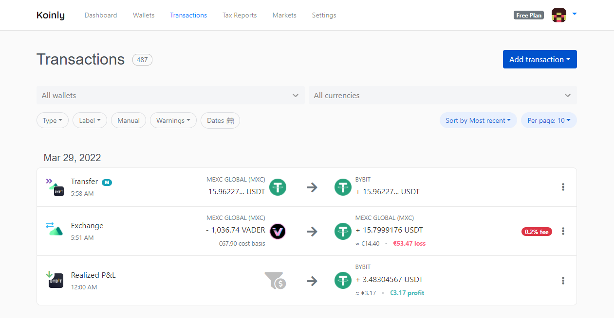
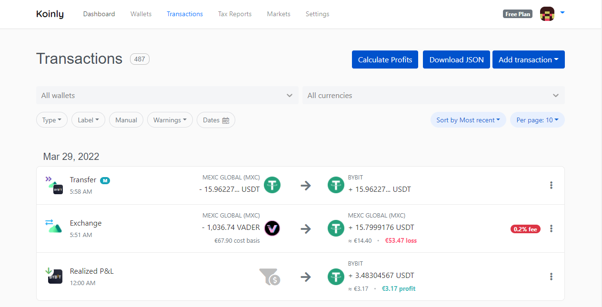
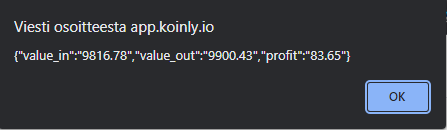

# Koinly Extension

## Description
Chrome extension for Koinly to calculate profits on crypto required by IRS in Finland. Koinly does not provide this information. The extension also allows to download all transaction data held by Koinly.

## Visuals
Without extension

With extension

Calulate profits


## Installation
Clone repository
```
git clone https://github.com/ValvojaX/koinly_extension.git
```
Head to chrome → settings → extensions <br>
Turn on developer mode <br>
Load unpacked <br>
Select the repository folder

## Usage

Turn on the extension and head to https://app.koinly.io/p/transactions. Refresh the page if the buttons aren't loaded. Click "Download JSON" to download all transactions from Koinly. Click "Calculate Profits" to get the needed values for tax report. Make sure the result is the same as in https://app.koinly.io/p/reports.